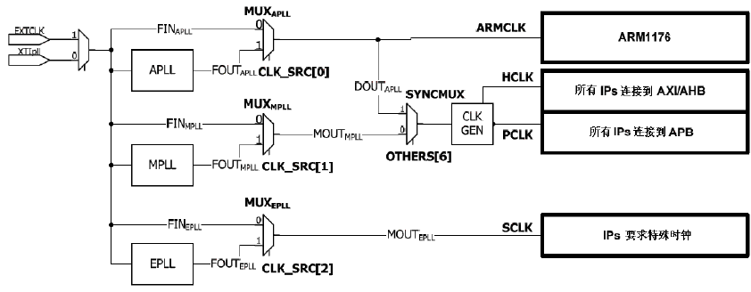

# clock
&emsp;说明Tiny6410的时钟情况.

## 主要的时钟
&emsp;在S3C6410 中生成所需的系统时钟信号，用于CPU 的ARMCLK, AXI/AHB 总线外设的HCLK和APB总线外设的PCLK。所以在S3C6410 中有三个PLL(锁相环电路)。一个PLL用于ARMCLK，一个用于PCLK和HCLK，一个用于外设时钟。

## PLL
&emsp;S3C6410提供三种PLL:APLL(ARM PLL)，MPLL(Main PLL)和EPLL(Extra PLL)。

	1. ARMPLL, 用于ARMCLK (for CPU); 
	2. main PLL, 用于HCLK & PLK (AHB/APB总线设备);
	3. extra PLL, 用于外设 (供UART,IIS,IIC使用, especially for audio related clocks.); 

它们提高不同倍数来给不同模块来使用。理论上PLL可以倍频到1.6GHz.
		

## 晶振
&emsp;S3C2440/S3C6410上的晶振的频率一般是12MHz/20MHz

## Fout计算
	Fout = MDIV * Fin / (PDIV * 2SDIV)
	这里，用于APLL 和MPLL 的 MDIV，PDIV，SDIV 必须符合以下条件：
	MDIV: 56 ≤ MDIV ≤ 1023
	PDIV: 1 ≤ PDIV ≤ 63
	SDIV: 0 ≤ SDIV ≤ 5
	FVCO (=MDIV X FIN / PDIV): 1000MHz ≤ FVCO ≤ 1600MHz
	FOUT: 31.25MHz ≤ FVCO ≤ 1600MHz
	
Uboot中提供了几类系统时钟的设定，比如设定ARMCLK为532，666等。如果选择了CONFIG_CLK_532_133_66，则意味着配置ARMCLK为532MHz，HCLK为133MHz，PCLK为66MHz。

	/* input clock of PLL */
	#define CONFIG_SYS_CLK_FREQ  12000000 /* the SMDK6400 has 12MHz input clock */

	#elif defined(CONFIG_CLK_532_133_66) /* FIN 12MHz, Fout 532MHz */
	#define APLL_MDIV       266
	#define APLL_PDIV       3
	#define APLL_SDIV       1
	#define CONFIG_SYNC_MODE
	
