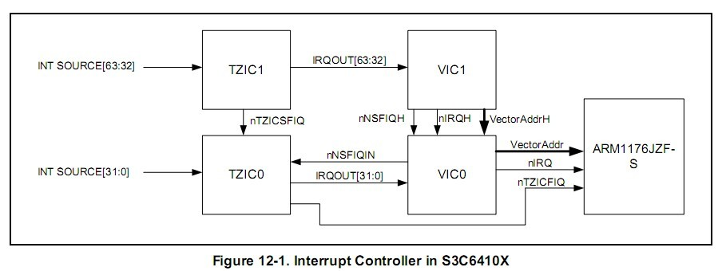
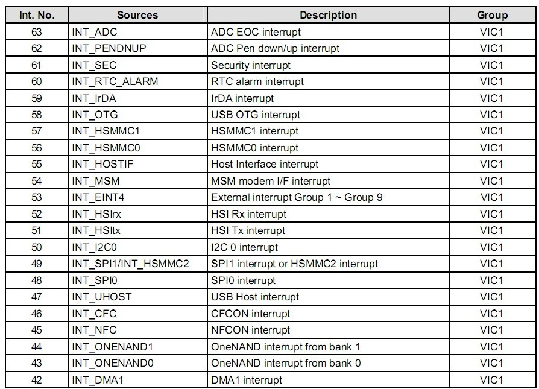
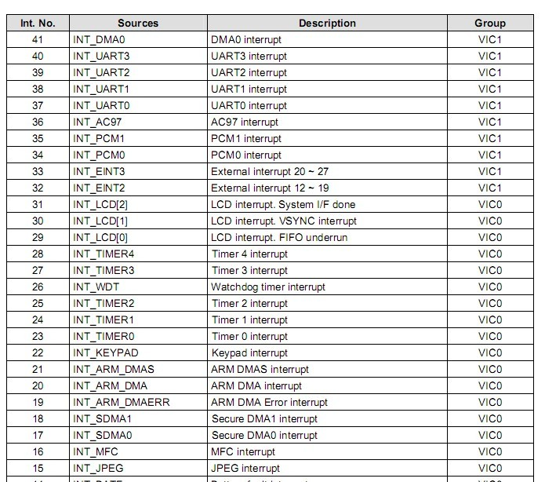
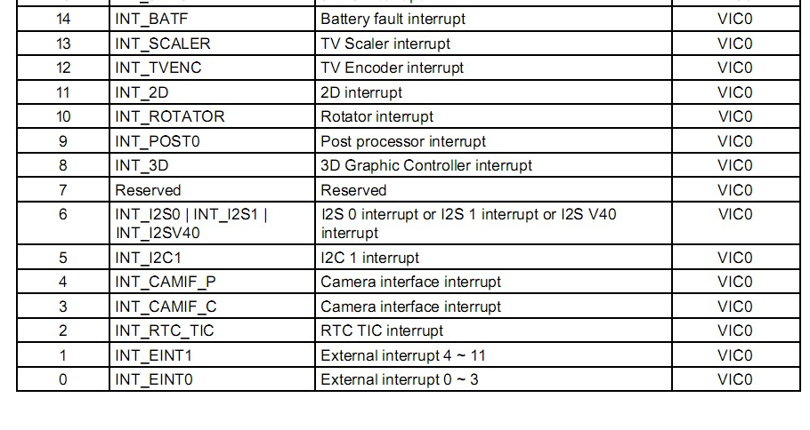

Tiny6410 interrupt
====

## ARM体系CPU的7种工作模式

1. 用户模式（usr）：正常的程序执行状态
2. 快速中断模式（fiq）：用于高速数据传输或通道处理
3. 中断模式（irq）：用于通用的中断处理
4. 管理模式（svc）：操作系统使用的保护模式
5. 系统模式（sys）：运行具有特权的操作系统任务
6. 数据访问终止模式（abt）：当数据或指令预取终止时进入该模式，可用于虚拟存储以及存储保护
7. 未定义指令终止模式（und）：当未定义的指令执行时进入该模式，可用于支持硬件

## S3C6410 - VECTORED INTERRUPT CONTROLLERS
 
 参考资料: S3C6410X.pdf - Chapter 12 - VECTORED INTERRUPT CONTROLLERS   
 This chapter describes the functions and usage of Vectored Interrupt Controller in S3C6410X RISC microprocessor.
 
 
 与S3C2440的中断处理机制相比, S3C6410大大简化了中断编程处理：   
  
 * 增加中断向量控制器，这样在S3C2440里需要用软件来跳转的中断处理机制，在S3C6410完全由硬件来跳转。（即，在S3C2440下是由CPU触发IRQ/FIQ异常，在异常处理函数中，查找相关中断寄存器来跳到指定的ISR。而在S3C6410中可以全部由S3C6410的VIC硬件来自动处理。 ）（这里注意**异常处理函数**并不是**中断处理函数**）
 * 6410为外部中断加入滤波电路，这样原来需要软件去毛刺的地方均可以采用硬件来进行滤波。
 * 为了向下兼容，6410保留了2410的软件中断跳转方式，在三星的文档里被称为SystemBUS模式。软件中断跳转方式是默认的,而其特有的VIC Port模式则要手动开启。  
&emsp;**注意**：软件中断跳转是指，发生中断时，具体跳转到哪个中断处理函数由软件负责。

### 1、VIC简介
&emsp;The interrupt controller in the S3C6410X is composed of 2 VIC’s (Vectored Interrupt Controller, ARM PrimeCell PL192) and 2 TZIC’s (TrustZone Interrupt Controller, SP890).

特性：

* 每个VIC控制器包含32向量中断
* 固定的硬件中断优先级别
* 可编程的中断优先级
* 支持硬件的中断优先级屏蔽
* 可编程的硬件的中断优先级屏蔽
* 可产生一般中断和快速中断
* 可产生软件中断
* 原生的中断状态
* 中断请求状态
* 支持特权模式来限制访问

S3C6410共有64个中断源，64个中断按硬件分组分成VIC0, VIC1两个组，各组由一个相应寄存器来处理。   

* 中断号为0-31是VIC0组, INT SOURCE[31:0]
* 中断号为32-63是VIC1组, INT SOURCE[63:32]

一个中断控制器是用来处理多个中断源的外围设备，通常包含以下几个特性：

* 为每个中断源分配一个中断请求输入端口。为每个中断请求分配一个中断请求输出端口，以能连接到处理器的VIC端口。(VIC作为一个桥梁连接中断源和处理器)
	
		中断源-------->PL192 VIC--------->处理器VIC端口
* 可以用软件屏蔽掉任意制定的中断源的中断
* 可以为每个中断设置优先级

以上都是中断控制器做的事情，**软件方面，需要编程**：

* 确定请求服务的中断源（从而决定应该调用哪个中断服务函数）
* 编写中断处理函数
* 确定中断处理程序的地址（中断服务函数地址）

### 2、VIC的快速中断处理
&emsp;PL192 VIC是不支持快速中断的，所以在s3c6410中断流程图中，所有的快速中断跑到VIC1, 然后经过nNSFIQH到VIC0, 然后经过nNSFIQIN到TZIC0, 然后经过nTZICFIQ发送到ARM1176;

### 3、寄存器配置
**1. 打开中断VICxINTENABLE**    

Interrupt Enable Register     

1. 0-31中断使用VIC0INTENABLE(0x7120_0010)
2. 32-63中断使用VIC1INTENABLE(0x7130_0010)    

* 0 = interrupt disable (reset)    
* 1 = interrupt enable    

VICxINTENABLE用来使能中断，VICxINTENCLEAR用来关闭中断。
给VICxINTENABLE的某一位写0是无法关闭中断的。

**2. 关闭中断VICxINTENCLEAR**    

Interrupt Enable Clear Register   

1. VIC0INTENCLEAR(0x7120_0014)
2. VIC1INTENCLEAR(0x7130_0014)

* 0 = no effet 
* 1 = interrupt disabled in VICINTENABLE

**3. 设置中断类型**    

设置某一个中断是IRQ还是FIQ，注意只有一个中断才能FIQ。
设置对应位1表示设为FIQ模式。

1. VIC0INTSELECT(0x7120_000C)
2. VIC1INTSELECT(0x7130_000C)

* 0 = IRQ interrupt(reset)
* 1 = FIQ interrupt

**4. 设置中断服务函数地址(ISR)**    

S3C6410用两个32个地址连续的寄存器，组成两个寄存器数组，分别表示中断服务函数。可以像指针数组一样来操作它们，数组的下标就是中断号，例如第3号中断函数地址VIC0VECTADDR[3];   
    
Vector Address [31:0] Register       

1. VIC0VECTADDR[31:0], (0x7120_0100 ~ 0x7120\_017C)
2. VIC1VECTADDR[31,0], (0x7130_0100 ~ 0x7130\_017C)

**5. 设置中断优先级**    

Vector Priority [31:0] Register   

1. VIC0VECTPRIORI[31,0], (0x7120_0200 ~ 0x7120\_027C)
2. VIC1VECTPRIORI[31,0], (0x7130_0200 ~ 0x7130\_027C)

每个寄存器的取值范围位0~15, 只使用[3:0]这四位。默认值为0xF;

----

### 4、外部中断

64个中断源中，除了INT_EINT0~INT_EINT4以外(通过CPU外的外设触发中断)，其他中断都是由S3C6410内部的模块所触发，称为内部中断。

#### 外部中断引脚
S3C6410共有127个外部中断，其外接I/O引脚及分组如下：

1. Group 0（共28脚）, GPN0~GPN15, GPL8~GPL14, GPM0~GPM4
2. Group 1, GPA0~GPA7, GPB0~GPB6
3. Group 2, GPC0~GPC7
4. Group 3, GPD0~GPD5
5. Group 4, GPF0~GPF14
6. Group 5, GPG0~GPG7
7. Group 6, GPH0~GPH9
8. Group 7, GPO0~GPO15
9. Group 8, GPP0~GPP14
10. Group 9, GPQ0~GPQ9

#### 外部中断源

外部中断引脚对应VIC的中断号：

| Int. No.| Sources | Description |
| :------:| :-----: | :---------: |
|53| INT_EINT4| External interrupt Group 1 ~ Group 9 |
|33| INT_EINT3| External interrupt Group 0: 20 ~ 27|
|32| INT_EINT2| External interrupt Group 0: 12 ~ 19|
|1|INT_EINT1|External interrupt Group 0: 4 ~ 11|
|0|INT_EINT0|External interrupt Group 0: 0 ~ 3|

外部中断一共占用VIC的5个中断号，且其中四个是外部中断组0(External interrupt Group 0), 外部中断组1~9只占用一个VIC中断号(No.53, External interrupt Group 1 ~ Group 9);

为了节约中断，不可能为每个外部管脚都分配一个中断号，所以就会把某几个外部中断给合并成一个中断号。例如，对于外部中断0-3，就合并成了一个中断号，INT\_EINT0。当这4个中断有任意一个产生中断时，INT_EINT0会挂起，CPU就会知道产生了外部中断0-3中断，然后去执行中断处理，在中断服务程序中，为了知道具体是哪一个中断，还需要去查询寄存器以知道是哪一个中断产生。    

中断脚的判断：   
不同的IO脚上多个设备产生同一个中断，软件如何知道是哪一个脚？   
由External Interrupt Pending Register 来判断     

* 第0组由EINT0PEND来判断
* 第1，2组由EINT12PEND来判断
* 依此类推，EINT34PEND，EINT56PEND， 一直到EINT9PEND 来指示

## S3C6410中断处理方式

S3C6410中断处理有向量模式和非向量方式。    
因为要与之前的ARM系列兼容，所以保存了非向量方式。   

### 1. System BUS调用    
	向下兼容（与S3C2440中断机制相同）, 非向量方式，就是当中断产生时，都跳转到中断**异常**去，然后这个中断异常中，编写程序，判断是哪一个中断产生，然后去执行对应的中断处理程序。
	
		中断信号产生(中断源) 
		-> 中断信号过滤(中断控制器) 
		-> 中断信号处理(CPU) 
		-> CPU接受到中断信号，直接跳转到用户设置好的中断处理程序中 
		-> 保存环境 
		—> 判断具体中断源，调用对应中断服务程序 
		-> 恢复环境，PC指向中断时的指令继续执行
	
## 2. VIC Port模式调用    
	在非向量模式中，提前设定每个中断对应的入口地址，这样当中断产生的时候，就不用跳转到中断异常去了，直接跳转到对应的中断程序去了。这样中断处理的效率就提高了。    
	系统产生中断后，由VIC直接执行相应的中断服务函数。（效率高，编程简单，需要在程序初始时加一段代码）    
	
		中断信号产生(中断源) 
		-> 中断信号过滤(中断控制器) 
		-> 中断信号处理(CPU) 
		-> 中断程序总入口
		-> 保存环境
		-> 判断具体中断源，调用对应中断服务程序
		-> 恢复环境

----

## S3C6410的中断处理编程

### VIC中断处理编程（向量中断处理）
 外部中断除了中断编程所有流程外，一般额外配置相应的GPxCON配置成中断脚。还要配置滤波方式和中断信号方式，还要打开外部中断掩码。（对于外部中断需要步骤1，对于非外部中断不需要步骤1）

1. 中断源设置   
	1. 配置GPIO     
		配置相应的I/O口的寄存器GPxCON, 为中断模式。
	2. EINTxCONx，外部中断信号类型，设置何种信号才会被捕获。      
	主要是五种，低电平，高电平，上升沿，下降沿或者两者均可：    
	
		* 第0组用 EINT0CON0/EINT0CON1两个寄存器来设定.
		* 第1，2组采用 EINT12CON,
		* 第3,4组采用EINT34CON,    
		* 依此类推    
	
	3. EINTxMASK，外部中断组x的屏蔽寄存器          
	屏蔽某个外部中断，0＝发生中断,1＝不发生中断,默认是全屏蔽的。   
	当要使用某个中断的时候，就需要让这个中断使能，就需要在这个寄存器中的对应位写入0，来打开中断。    
		* EINT0MASK是第0组的使用   
		* EINT12MASK是第1,2组的中断掩码
	
	4. EINTxPEND，外部中断组x的中断挂起寄存器。   
		这个寄存器就是用来保存中断的状态的。当对应的中断产生时，对应的位为1。当中断处理完毕后，需要往对应对写入1进行清除。
	5. 过滤控制寄存器EINTxFLTCONx，设置滤波方式，延迟滤波或数字滤波。       
	对于一些波形不规整的外部中断信号，可以通过滤波电路让其变成规整，这样会简化软件的编写。     
  S3C6410有两种滤波电路，一种延时滤波（如按钮类中断可以采用这一类型），一种是数字采样滤波，其中数字采样滤波电路还要设采样宽度。

		* 第0组的滤波用EINT0FLTCON0，EINT0FLTCON1，EINT0FLTCON2，EINT0FLTCON3配置。
		* 第1,2组的滤波采用 EINT12FLTCON
		* 第3,4组的滤波采用 EINT34FLTCON
		* 第9组滤波 采用EINT9FLTCON    

		FLTEN表示是否打开滤波功能,FLTSEL是设置滤波方式，EINTn表示数字滤波采校的宽度。

2. 中断控制器VIC配置
	
	1. 在协处理器中开启VIC，在协处理器里设置VE位。
			
			mrc p15, 0, r0, c1, c0, 0
			orr r0, r0, #(1 << 24)
			mcr p15, 0, r0, c1, c0, 0
		将协处理器P15的寄存器C1中的bit24置1，该比特位为VIC使能位。    
	2. 关中断，清矢量地址寄存器并配置中断类型     
		
		* VICxINTENCLEAR, 写1 DISABLE
		* VICxINTSELECT,0=IRQ,1=FIQ
		* VICxADDRESS,矢量地址寄存器清零

	3. 配置中断函数入口地址 VICxVECTADDR[x]    
	4. VIC使能中断     
		VICxINTENABLE, 1=ENABLE, 写0无效    
		DISABLE只能通过VICxINTENCLEAR写1更改
	5. 总中断使能, CPSR Bit 8位I , 置1 ENABLE

3. 编写中断处理函数
	1. 保存环境（中断函数前和后要使用嵌入汇编，保存环境和恢复环境。）
	2. 中断服务处理
	3. 中断挂起位清零
	4. 中断执行地址清楚（VICxADDRESS寄存器在中断执行时，其值为中断函数的入口地址。中断执行完以后，要清零）
	5. 恢复环境
		

### 非向量中断处理

